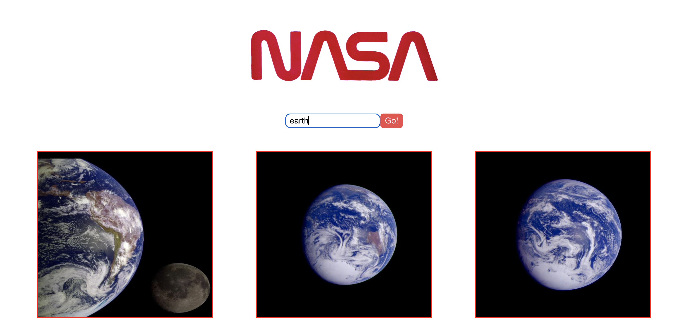

# NASA Image Search

## About

A Manchester Codes "tech-test" style project with the aim of building a React application that lets users search for images based on a query.

View live [project](https://greenchul.github.io/NASA-image-search/)

## Installation

- Clone this repo
- `cd` in to repo
- Run `npm install`
- Run `npm start` to start the project

## Testing

The project uses the React Testing Library and Jest for testing.

Tests can be run using the following command `npm test`

## Packages

The project uses the following packages:

- Axios: for making API calls
- PropTypes: for validating props
